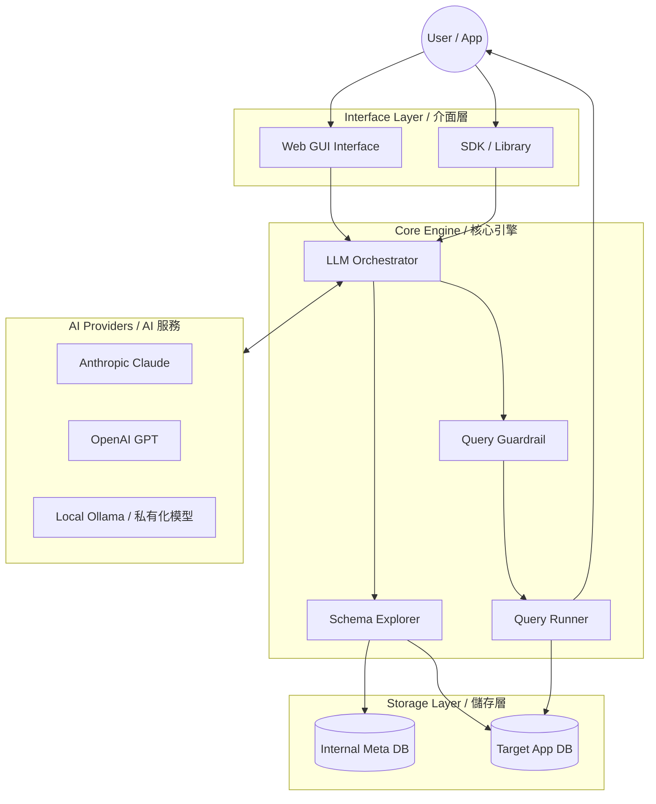

# 🚀 DBPilot V3
AI-Powered Natural Language Database Query Co-Pilot | 自然語言資料庫查詢副駕駛


DBPilot translates **Natural Language** into safe, optimized database queries. It bridges the gap between complex data structures and non-technical stakeholders, significantly **reducing the burden on Developers and Customer Service teams**.

DBPilot 將 **自然語言** 轉換為安全、優化的資料庫查詢。它消除了複雜資料結構與非技術人員之間的溝通障礙，顯著 **減輕開發端與客服團隊的負擔**。

---

# 🎬 DEMO 影片示範
### [點此觀看 Demo 影片 / Watch Demo on YouTube](https://www.youtube.com/watch?v=xbvpvycP0N8)

---

## 🏗 System Architecture (系統架構)



---

## ✨ Key Features (主要功能)

### 🧠 Intelligent Schema Mapping (AI 結構理解)
- **EN**: Automatically analyzes collections, relationships, and types to build a semantic map.
- **ZH**: 自動分析資料庫結構、關聯鍵與資料型別，為 AI 生成精準的商業邏輯地圖。

### 🛡 Multi-Layer Guardrails (多層安全防護)
- **EN**: Blocks destructive operations (delete, drop), enforces limits, and supports blacklisting.
- **ZH**: 內建危險語法攔截（刪除、刪庫）、強迫回傳筆數限制、以及敏感集合黑名單。

### 📖 Unified Dialogue History (對話流歷史)
- **EN**: Modern chat-like interface that persists history downwards with soft-delete support.
- **ZH**: 現代化對話式介面，支援歷史紀錄向下延伸保存，並提供 UI 軟刪除與後端完整追蹤。

### 🔌 Dual Integration (雙模式接入)
- **Standalone GUI**: Wizard-style web interface. / 導引式網頁介面。
- **Native SDK**: Embed directly into Node.js apps. / 直接嵌入 Node.js/TS 專案。

### 🏠 Local AI Support (支援 Ollama)
- **EN**: Connect to local models via **Ollama** for 100% data privacy and no API costs.
- **ZH**: 支援透過 **Ollama** 連接本地模型，確保 100% 資料隱私並節省 API 費用。

---

## 🛠 Quick Start (快速開始)

### 0️⃣ Prerequisites (前置準備)
> [!IMPORTANT]
> **Privacy First**: DBPilot stores metadata locally. Use an internal MongoDB for audit logs.
> **隱私優先**: DBPilot 會將結構元數據與稽核紀錄存在本地。請務必指定自己的內部 MongoDB。

1. **MongoDB** (127.0.0.1:27017) must be running. / 確保 MongoDB 已啟動。
2. Install dependencies / 安裝套件:
   ```bash
   npm install
   ```

### 1️⃣ Setup (設定)
Create a `.env` file in the root / 建立 `.env` 檔案:
```env
ANTHROPIC_API_KEY=your_key
OPENAI_API_KEY=your_key
OLLAMA_BASE_URL=http://localhost:11434
```

### 2️⃣ Run (啟動)
```bash
npm run gui
```
Open **[http://localhost:4000](http://localhost:4000)** and follow the wizard. / 開啟連結並依導引完成三步驟設定。

---

## 📦 SDK Usage (SDK 使用範例)

```typescript
import { DBPilotCore } from 'dbpilot';

const pilot = new DBPilotCore({
  targetDatabaseUri: 'mongodb://127.0.0.1:27017/my_app',
  requireUserApproval: true // Human-in-the-loop
});

await pilot.initialize();

// Just ask! / 直接提問！
const result = await pilot.ask("找出上個月消費超過 1000 元的客戶");
console.log(result.summary);
```

---

## 🎬 Credits
- ⚠️ This project is **~95% generated** using AI (Claude 3.5 Sonnet & GPT-4o).

---
© 2026 DBPilot Open Source Project. All rights reserved.
